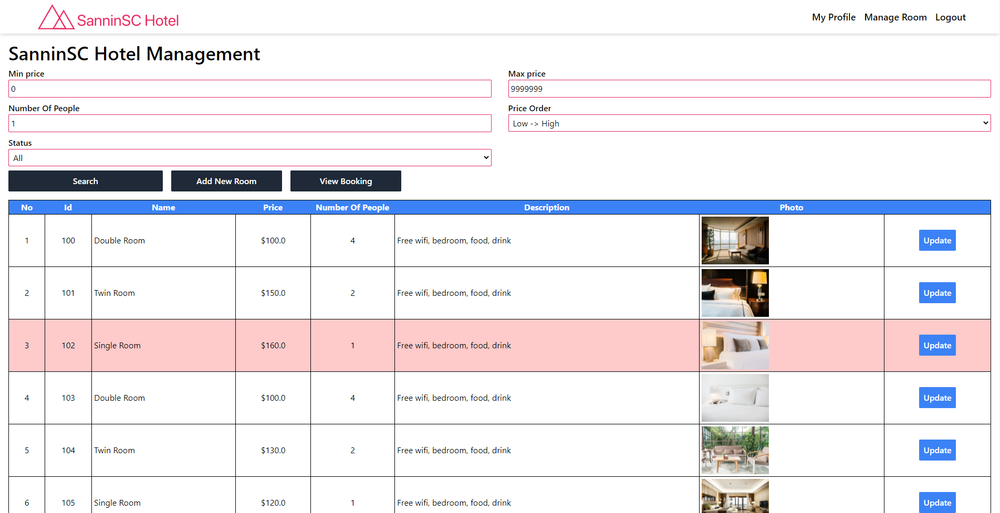
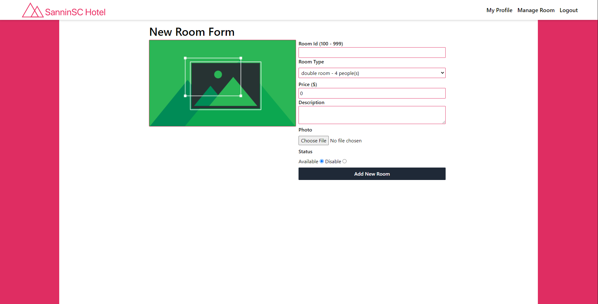

# Booking Hotel - Servlet + JSP

## Case Study

Creating a hotel website for SinninSC hotel allows user and manager to create their account and do action with their role.

## Feature by role

- ### Common Role Action
     - Login, register new account and logout
     - Change password
     - Update user information
- ### User Role Action
     - Create new booking
     - Create feedback for a room
     - Cancel Booking
     - Review booking
- ### Admin Role Action
     - Create new room
     - Update information for a room
     - Checkout or cancel booking
     - Manage all room

## Technology

- Frontend
     - JSP - Server Side Rendering
     - Tailwind - Styling
     - Javascript
- Backend
     - Servlet - Server Core
     - SQL Server 2019 - Database

## Team Member

- Cao Chí Hải
- Trương Bỉnh Tân
- Phạm Vĩnh Nhân

## Project Picture

### Database Diagram

### Home Page

### Management Page

### Add New Room

### Login Page

## Bug Report

Feel free to create an issue request anytime we will check it out and fix it as soon as possible. Thank You So Much.
