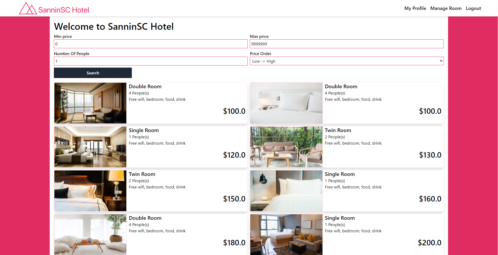

# Booking Hotel - Servlet + JSP + Tailwind

## Case Study

A large hotel chain in the US, the SanninSC Hotels Group. The group consists of ten hotels, organized in one place. Each hotel has between 40 and 100 bedrooms (can extend), which are categorized as double (D), twin(T), single(S), queen(Q), king(K),or luxury(L). Double and twin rooms may be let as singles. There are no online systems. A new group managing director has recently been appointed. One of the director's major objectives is to increase profit. The director has therefore appointed a firm of consultants to investigate and define the IT requirements of the company.

## Feature by role

- ### Both Role Action
     - Login, register new account and logout
     - Change password
     - Update user information
- ### Customer Role Action
     - Add new booking to cart
     - Booking or cancel in cart
     - Cancel Booking
     - Review booking
     - Checking booking information
- ### Admin Role Action
     - Create new room
     - Update information for a room
     - Checkout (2 options ) or cancel booking
     - Manage all room
     - Manage all booking

## Technology

- Frontend
     - JSP - Server Side Rendering
     - Tailwind - Styling
     - Javascript
- Backend
     - Servlet - Server Core
     - SQL Server 2019 - Database
- Deployment
     - Docker - Container Management
     - Github Action - CI/CD

## Team Member

- Cao Chí Hải
- Trương Bỉnh Tân
- Phạm Vĩnh Nhân

## Project Picture

### Database Diagram

#### Entity Diagram

#### Relational Diagram

### Home Page

### Management Page

### Add New Room

### Login Page

## Bug Report

Feel free to create an issue request anytime we will check it out and fix it as soon as possible. Thank You So Much.
